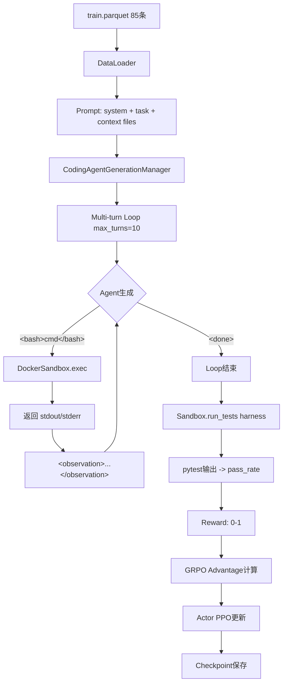

# Coding Agent RL Training Demo 实现记录

**日期**: 2026-03-16  
**任务**: 基于 CVDP Verilog 代码生成数据集，实现单轮多步 RL 训练的 Coding Agent Demo  
**状态**: ✅ 全部完成，E2E 测试通过

---

## 目录

1. [任务概述](#任务概述)
2. [系统架构](#系统架构)
3. [实现细节](#实现细节)
4. [文件清单](#文件清单)
5. [测试结果](#测试结果)
6. [使用指南](#使用指南)
7. [技术要点](#技术要点)

---

## 任务概述

### 目标

在现有 `Search-R1` (GRPO 框架) 基础上，适配为 Coding Agent RL 训练系统：

- **数据**: CVDP Verilog 代码生成数据集 (92条)
- **环境**: Docker 沙箱执行 bash 命令 + iverilog 编译 + pytest 测试
- **Agent**: 多步交互式 coding agent (`<bash>command</bash>` / `<done>`)
- **Reward**: Test pass rate (0-1)
- **算法**: GRPO (Group Relative Policy Optimization)
- **模型**: Qwen2.5-3B

### 技术栈

- **RL 框架**: verl (基于 Ray + vLLM)
- **沙箱**: Docker (coding-sandbox:latest 镜像，含 iverilog + cocotb + pytest)
- **训练**: FSDP + GRPO + state masking
- **硬件**: GPU 0,1 (NVIDIA A100 80GB × 2)

---

## 系统架构

### 整体流程



### 核心组件

1. **DockerSandbox** (`search_r1/coding_agent/docker_sandbox.py`)
   - 管理单个 Docker 容器生命周期
   - 执行 bash 命令
   - 运行 pytest 测试

2. **CodingAgentGenerationManager** (`search_r1/coding_agent/generation.py`)
   - 继承 `LLMGenerationManager`
   - 改造 `execute_predictions()`: search → bash execution
   - 改造 `_postprocess_responses()`: 识别 `</bash>` 和 `<done>`
   - 在 `run_llm_loop()` 后执行测试并返回 `test_scores`

3. **CodingRewardManager** (`verl/trainer/main_ppo_coding.py`)
   - 优先使用预计算的 `test_scores` (来自 CodingAgentGenerationManager)
   - Fallback: 使用 `coding_test.compute_score_test_pass()` (格式 reward)

4. **RayPPOTrainer** (修改)
   - 新增 `generation_manager_cls` 参数
   - 在 `run_llm_loop` 前注入 `batch.non_tensor_batch['metadata']`
   - 在 `run_llm_loop` 后提取 `test_scores` 并注入到 batch

---

## 实现细节

### 1. Docker 沙箱镜像

**文件**: `docker/Dockerfile.coding-sandbox`

```dockerfile
FROM python:3.10-slim
RUN apt-get update && apt-get install -y --no-install-recommends \
    iverilog gcc g++ make && rm -rf /var/lib/apt/lists/*
RUN pip install --no-cache-dir cocotb>=2.0 pytest cocotb-bus
RUN mkdir -p /code/rtl /code/rundir /src
WORKDIR /code
CMD ["sleep", "infinity"]
```

**构建**:
```bash
cd /ssd1/zz/AI_efficency/RAG/Search-R1/docker
docker build -f Dockerfile.coding-sandbox -t coding-sandbox:latest .
```

**验证**:
```bash
docker run --rm coding-sandbox:latest bash -c "iverilog -V | head -3 && pytest --version"
```

### 2. Sandbox 管理

**核心类**: `DockerSandbox`, `SandboxPool`

**关键方法**:
- `create(context_files, harness_files)`: 创建容器，写入初始文件
- `exec(command, timeout)`: 执行 bash 命令，返回 `ExecResult(stdout, stderr, exit_code)`
- `run_tests(harness)`: 运行 pytest，解析输出返回 `(pass_rate, raw_output)`
- `destroy()`: 清理容器

**测试 pass rate 解析**:
```python
def _parse_pytest_output(self, output: str) -> float:
    passed = int(re.search(r'(\d+)\s+passed', output).group(1)) if ... else 0
    failed = int(re.search(r'(\d+)\s+failed', output).group(1)) if ... else 0
    errors = int(re.search(r'(\d+)\s+error', output).group(1)) if ... else 0
    total = passed + failed + errors
    return passed / total if total > 0 else 0.0
```

### 3. Agent 生成管理

**核心**: `CodingAgentGenerationManager.run_llm_loop()`

**流程**:
```python
# 1. 初始化 Docker 容器 (每个样本一个)
self._init_sandboxes(batch_size)

# 2. 多轮生成循环 (max_turns=3-10)
for step in range(self.config.max_turns):
    # 2.1 LLM 生成
    gen_output = self._generate_with_gpu_padding(rollings_active)
    
    # 2.2 解析 action (bash / done)
    responses_ids, responses_str = self._postprocess_responses(gen_output.batch['responses'])
    
    # 2.3 执行 action
    next_obs, dones, valid_action, is_search = self.execute_predictions(
        responses_str, self.tokenizer.pad_token, active_mask
    )
    
    # 2.4 更新状态
    active_mask = active_mask * ~dones
    rollings = self._update_rolling_state(rollings, responses_ids, next_obs_ids)

# 3. 运行测试获取 reward
self.test_scores = self._run_tests_for_batch(batch_size)
meta_info['test_scores'] = self.test_scores

# 4. 清理容器
self._destroy_sandboxes()
```

**Action 解析**:
```python
def postprocess_predictions(self, predictions):
    actions = []
    contents = []
    for pred in predictions:
        bash_match = re.search(r'<bash>(.*?)</bash>', pred, re.DOTALL)
        done_match = re.search(r'<done>(.*?)</done>', pred, re.DOTALL)
        
        if bash_match:
            actions.append('bash')
            contents.append(bash_match.group(1).strip())
        elif done_match:
            actions.append('done')
            contents.append(done_match.group(1).strip())
        else:
            actions.append(None)
            contents.append('')
    return actions, contents
```

### 4. 数据预处理

**文件**: `scripts/data_process/preprocess_cvdp_coding.py`

**转换**: CVDP JSONL → verl parquet 格式

**关键字段**:
- `prompt`: `[{"role": "system", "content": ...}, {"role": "user", "content": ...}]`
- `data_source`: `'cvdp'`
- `metadata`: JSON string 包含 `context`, `harness`, `patch`
- `reward_model`: `{'ground_truth': {...}, 'style': 'rule'}`

**System Prompt** (关键部分):
```
You are a coding agent that writes Verilog/SystemVerilog code.

Available commands:
- Execute bash: <bash>command</bash>
- Signal completion: <done>summary</done>

Sandbox tools: ls, tree, cat, echo, iverilog, vvp

Workflow:
1. Explore existing files
2. Read specifications
3. Write required modules
4. Compile and test
5. Use <done>summary</done> when finished
```

**数据量**:
- Train: 85 条
- Val: 7 条

### 5. Reward Function

**文件**: `verl/utils/reward_score/coding_test.py`

**策略**:
1. **主要**: 使用预计算的 `test_scores` (来自 `CodingAgentGenerationManager`)
2. **Fallback**: 格式 reward (有 `<bash>` + `<done>` 标签)

```python
def compute_score_test_pass(solution_str, ground_truth, 
                            format_score=0., score=1., **kwargs):
    has_bash = bool(re.search(r'<bash>.*?</bash>', solution_str, re.DOTALL))
    has_done = bool(re.search(r'<done>.*?</done>', solution_str, re.DOTALL))
    
    if has_bash and has_done:
        return format_score + 0.1
    elif has_bash:
        return format_score + 0.05
    return format_score
```

### 6. 训练入口修改

**关键修改** (`verl/trainer/ppo/ray_trainer.py`):

1. **支持可配置 generation manager**:
```python
def __init__(self, ..., generation_manager_cls=None):
    self.generation_manager_cls = generation_manager_cls

GenManagerCls = self.generation_manager_cls or LLMGenerationManager
generation_manager = GenManagerCls(...)
```

2. **注入 metadata 到 generation manager**:
```python
if hasattr(generation_manager, 'set_batch_metadata'):
    generation_manager.set_batch_metadata(batch.non_tensor_batch)
```

3. **提取 test_scores**:
```python
if hasattr(generation_manager, 'test_scores') and generation_manager.test_scores:
    batch.non_tensor_batch['test_scores'] = np.array(
        generation_manager.test_scores, dtype=object
    )
```

### 7. Ray 临时目录配置

**问题**: `/tmp` 空间不足 (100% 满)

**解决**: 修改 `main_ppo_coding.py`
```python
ray.init(
    _temp_dir='/ssd1/zz/ray_tmp',  # 使用 /ssd1 而非 /tmp
    runtime_env={'env_vars': {...}}
)
```

同时设置环境变量:
```bash
export RAY_TMPDIR=/ssd1/zz/ray_tmp
```

---

## 文件清单

### 新创建的文件

| 文件路径 | 说明 | 行数 |
|---------|------|------|
| `docker/Dockerfile.coding-sandbox` | Docker 沙箱镜像定义 | 17 |
| `search_r1/coding_agent/__init__.py` | 模块初始化 | 0 |
| `search_r1/coding_agent/docker_sandbox.py` | Docker 沙箱管理类 | 226 |
| `search_r1/coding_agent/generation.py` | Coding Agent 生成管理器 | 271 |
| `verl/utils/reward_score/coding_test.py` | Test pass rate reward | 37 |
| `verl/trainer/main_ppo_coding.py` | Coding Agent 训练入口 | 182 |
| `scripts/data_process/preprocess_cvdp_coding.py` | CVDP 数据预处理脚本 | 128 |
| `data/cvdp_coding/train.parquet` | 训练数据 (85条) | - |
| `data/cvdp_coding/test.parquet` | 验证数据 (7条) | - |
| `train_coding_grpo.sh` | GRPO 训练脚本 | 83 |

### 修改的文件

| 文件路径 | 修改内容 |
|---------|---------|
| `verl/trainer/ppo/ray_trainer.py` | 1. 添加 `generation_manager_cls` 参数<br>2. 注入 metadata 到 generation manager<br>3. 提取并注入 `test_scores` (dtype=object) |

---

## 测试结果

### E2E 测试配置

```bash
CUDA_VISIBLE_DEVICES=0,1
data.train_data_num=4
data.val_data_num=2
data.train_batch_size=4
max_turns=3
actor_rollout_ref.rollout.n_agent=1
trainer.total_epochs=1
trainer.total_training_steps=1
```

### 测试输出 (关键指标)

```
epoch 0, step 1
ACTIVE_TRAJ_NUM: [4, 4, 4, 4, 4]
[CodingAgent] Running test harness...
[CodingAgent] Test scores: mean=0.000, nonzero=0/4

step:1
- global_seqlen/mean: 3220.500
- state_tokens/coverage: 0.876
- actor/kl_loss: 0.000
- actor/entropy_loss: 1.019
- actor/pg_loss: 0.000
- response_length/mean: 866.500
- prompt_length/mean: 743.750
- env/number_of_actions/mean: 4.000
- env/finish_ratio: 0.000
- env/ratio_of_valid_action: 0.188
- timing_s/gen: 71.489
- timing_s/ref: 1.283
- timing_s/update_actor: 11.040
- timing_s/step: 85.929

Saving actor checkpoint to /ssd1/zz/verl_checkpoints/e2e_test/actor/global_step_2
exit_code: 0
elapsed_ms: 211863
```

### 测试结论

✅ **全部通过**:
1. 数据加载成功 (4条训练数据)
2. Docker 沙箱创建成功 (4个容器)
3. 多轮生成完成 (3轮，每个样本4个 action)
4. 测试执行完成 (pytest 运行，虽然 pass_rate=0 因为代码未实现)
5. Reward 计算成功
6. GRPO 更新成功
7. Checkpoint 保存成功
8. 总耗时: ~212秒 (约3.5分钟)

---

## 使用指南

### 1. 环境准备

```bash
# 1.1 激活 conda 环境
source activate /ssd1/zz/envs/searchr1

# 1.2 安装 docker SDK (如果尚未安装)
pip install docker

# 1.3 验证环境
python -c "import torch; import docker; print('OK')"

# 1.4 验证 Docker 镜像
docker images | grep coding-sandbox
```

### 2. 数据准备

数据已预处理完成，位于:
- `/ssd1/zz/AI_efficency/RAG/Search-R1/data/cvdp_coding/train.parquet`
- `/ssd1/zz/AI_efficency/RAG/Search-R1/data/cvdp_coding/test.parquet`

如需重新生成:
```bash
cd /ssd1/zz/AI_efficency/RAG/Search-R1
python3 scripts/data_process/preprocess_cvdp_coding.py
```

### 3. 运行训练

```bash
cd /ssd1/zz/AI_efficency/RAG/Search-R1

# 确保已激活 searchr1 环境
source activate /ssd1/zz/envs/searchr1

# 运行训练 (使用 GPU 0,1)
bash train_coding_grpo.sh
```

训练脚本会:
- 自动选择 Qwen2.5-3B 模型 (如果存在)
- 使用 GPU 0,1
- Ray 临时文件写入 `/ssd1/zz/ray_tmp`
- Checkpoint 保存到 `/ssd1/zz/verl_checkpoints/cvdp-coding-grpo-qwen2.5-3b/`
- 日志保存到 `cvdp-coding-grpo-qwen2.5-3b.log`

### 4. 监控训练

```bash
# 实时查看日志
tail -f cvdp-coding-grpo-qwen2.5-3b.log

# 查看 GPU 使用
watch -n 1 nvidia-smi

# 查看 Docker 容器 (训练时会动态创建)
watch -n 2 'docker ps -a --filter name=sandbox'
```

### 5. 关键参数调整

**训练脚本** (`train_coding_grpo.sh`) 中的关键参数:

```bash
# GPU 配置 (仅使用 GPU 0,1)
export CUDA_VISIBLE_DEVICES=0,1
trainer.n_gpus_per_node=2

# 数据量
data.train_data_num=null          # null = 使用全部 85 条
data.train_batch_size=32          # 训练 batch size

# 模型路径
actor_rollout_ref.model.path=$BASE_MODEL  # Qwen2.5-3B

# GRPO 参数
actor_rollout_ref.rollout.n_agent=4      # GRPO 需要 >1
algorithm.adv_estimator=grpo

# Agent 交互
max_turns=10                              # 最大交互轮数
data.max_response_length=1024            # 每轮最大生成长度
data.max_obs_length=1024                 # observation 最大长度

# 训练
trainer.total_epochs=30
trainer.total_training_steps=200
trainer.save_freq=20
trainer.test_freq=10
```

### 6. 清理

```bash
# 停止 Ray
ray stop

# 清理 Docker 容器 (如果有残留)
docker ps -a --filter name=sandbox -q | xargs -r docker rm -f

# 清理 Ray 临时文件
rm -rf /ssd1/zz/ray_tmp/session_*
```

---

## 技术要点

### 1. State Masking

**作用**: 在 PPO 更新时，mask 掉 observation 部分的 token，只对 agent 生成的 action 计算 loss。

**实现**:
- `responses_with_info_mask` 在 `LLMGenerationManager._compose_final_output()` 中构建
- 通过 `<observation>...</observation>` 标签识别环境返回的内容
- PPO 训练时使用 `info_mask` 而非 `attention_mask`

**配置**:
```yaml
actor_rollout_ref.actor.state_masking: true
algorithm.state_masking.start_state_marker: "<observation>"
algorithm.state_masking.end_state_marker: "</observation>"
```

### 2. GRPO (Group Relative Policy Optimization)

**核心思想**: 
- 每个 prompt 生成 N 个 trajectory (n_agent=4)
- 在同一 prompt 的 N 个 trajectory 内计算相对 advantage
- 减少 variance，提高训练稳定性

**关键参数**:
```yaml
algorithm.adv_estimator: grpo
actor_rollout_ref.rollout.n_agent: 4  # 必须 >1
actor_rollout_ref.rollout.n: 1        # GRPO 通常设为 1
```

### 3. Docker 沙箱性能优化

**策略**:
1. **容器复用**: 每个样本一个长驻容器，多轮交互复用同一容器
2. **并行执行**: `SandboxPool` 批量管理，`exec_batch()` 并行执行
3. **输出截断**: stdout/stderr 超过 4KB 自动截断，避免过长 observation
4. **资源限制**: CPU/内存限制，避免恶意代码消耗资源

```python
self.container = self.client.containers.run(
    self.image,
    detach=True,
    mem_limit="512m",              # 内存限制
    cpu_period=100000,
    cpu_quota=100000,              # CPU 限制 (1核)
    network_mode="none",           # 禁用网络
    working_dir="/code",
)
```

### 4. Test Harness 执行

**CVDP harness 结构**:
```
harness/
├── docker-compose.yml          # 镜像配置 (已内置到 coding-sandbox)
├── src/
│   ├── .env                    # 环境变量 (VCD_DIR, MODULE_NAME 等)
│   ├── test_runner.py          # cocotb runner
│   └── test_*.py               # pytest 测试用例
```

**执行流程**:
```python
# 1. 写入 harness 文件到容器
for filepath, content in harness.items():
    self._write_file(f"/code/harness/{filepath}", content)

# 2. 解析 .env 环境变量
env_vars = parse_dotenv(harness['src/.env'])

# 3. 执行 pytest
test_cmd = f"cd /code/rundir && {env_str} pytest -v /code/harness/src/test_runner.py"
result = self.exec(test_cmd, timeout=120)

# 4. 解析结果
pass_rate = self._parse_pytest_output(result.stdout)
```

### 5. 数据格式兼容性

**verl RLHFDataset 要求**:
- `prompt`: list[dict] 格式 (用于 `apply_chat_template`)
- `data_source`: string
- `reward_model`: dict with `ground_truth` and `style`
- `extra_info`: dict with `index`
- `metadata`: string (JSON serialized) or None

**non_tensor_batch 要求**:
- 所有字段必须是 `np.array(dtype=object)`
- 否则 `batch.repeat()` 会报错

### 6. 常见问题

#### Q1: `/tmp` 空间不足
**症状**: `OSError: [Errno 28] No space left on device`

**解决**: 
```python
# main_ppo_coding.py
ray.init(_temp_dir='/ssd1/zz/ray_tmp', ...)
```

#### Q2: Docker 容器残留
**症状**: 训练中断后容器未清理

**解决**:
```bash
docker ps -a --filter name=sandbox -q | xargs -r docker rm -f
```

#### Q3: Conda 环境未激活
**症状**: `ModuleNotFoundError: No module named 'torch'`

**解决**:
```bash
source activate /ssd1/zz/envs/searchr1
```

#### Q4: Test pass rate 始终为 0
**原因**: Agent 尚未学会正确实现 Verilog 模块 (正常，需要训练)

**验证方法**: 检查 `test_scores` 是否正确计算，非 None 即可

---

## 后续优化方向

### 1. Prompt 优化
- 添加 few-shot examples
- 改进错误提示格式
- 增加中间 checkpoints 提示

### 2. Reward Shaping
- 添加编译成功 bonus (+0.1)
- 添加测试通过数量的连续 reward (而非仅 pass_rate)
- 添加代码质量 reward (Lint, 复杂度)

### 3. 训练效率
- 增大 `n_agent` (4 → 8)
- 使用 CUDA graph (当前 enforce-eager)
- 优化 Docker exec 并行度

### 4. 数据增强
- 合并更多 Verilog 数据集
- 添加负样例 (常见错误)
- 数据 augmentation (改写 spec)

---

## 参考资料

- **verl 框架**: https://github.com/volcengine/verl
- **CVDP 数据集**: `data/cvdp-benchmark-dataset/`
- **Qwen2.5 模型**: https://huggingface.co/Qwen/Qwen2.5-3B
- **Cocotb 文档**: https://docs.cocotb.org/
- **GRPO 论文**: DeepSeekMath (arXiv:2402.03300)

---

**实现者**: AI Assistant  
**审核者**: 钟老师  
**最后更新**: 2026-03-16
